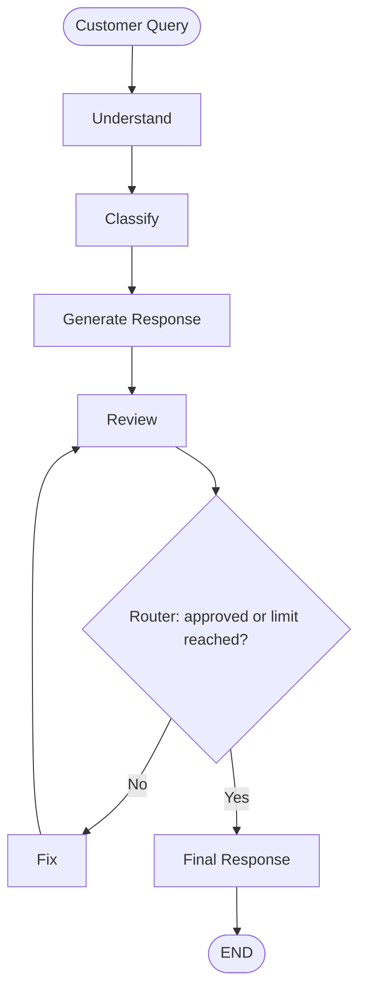

<div align="center">

# 🤖 AI Customer Support Resolution Agent

### A multi-step agentic workflow built with **LangGraph**

*Understand → Classify → Draft → Review → Fix → Finalize*


</div>

---

## 📖 Overview

This project is an AI agent that helps customer-support representatives prepare replies to customer questions and complaints for an e-commerce company.

The agent **does not talk to the customer directly**. It prepares a draft reply that a human support representative can review before sending.

Instead of one big prompt, the work is split into specialised steps (nodes) in a **LangGraph** graph. A reviewer node checks every draft, and a **conditional edge** decides whether the draft is final or needs another improvement pass.

---

## ✨ Features

- 🧠 **Multi-node LangGraph workflow** with shared state
- 🏷️ **Structured output** (Pydantic schemas) for classification and review
- 🔀 **Conditional routing** driven by the reviewer's decision
- 🔁 **Review/fix loop** with a hard limit of 2 cycles, so it can never loop forever
- 🛡️ **Safety-aware review**: drafts that promise refunds, dates or timelines are rejected
- ❓ **Handles vague queries**: asks for details instead of inventing them
- 🧯 **Error handling** with safe fallbacks at every LLM call
- 💾 **Saves results** as text and JSON

---

## 🗺️ Workflow



```
CUSTOMER QUERY
      │
      ▼
 UNDERSTAND ──► CLASSIFY ──► RESPONSE ──► REVIEW ──► ROUTER
                                             ▲          │
                                             │     ┌────┴─────┐
                                             │   NO│          │YES
                                             │     ▼          ▼
                                             └───FIX        FINAL ──► END
```

---

## 🧩 How It Works

| # | Node | Job | Writes to state |
|---|------|-----|-----------------|
| 1 | **Understand** | Extracts issue, context, intent, key details and missing information | `issue_summary` |
| 2 | **Classify** | Picks a category and priority (structured output) | `category`, `priority` |
| 3 | **Response** | Drafts a professional, concise reply suited to the category | `generated_response` |
| 4 | **Review** | Checks accuracy, completeness, tone, safety, relevance (structured output) | `approved`, `review_feedback` |
| 5 | **Fix** | Rewrites the draft using the reviewer's feedback | `generated_response`, `iteration_count` |
| 6 | **Final** | Accepts the current draft as the final reply | `final_response` |

### Categories and priorities

- **Categories:** `ORDER_STATUS`, `DAMAGED_PRODUCT`, `WRONG_PRODUCT`, `REFUND`, `PAYMENT`, `CANCELLATION`, `OTHER`
- **Priorities:** `LOW`, `MEDIUM`, `HIGH`

### Conditional routing

After every review, the router function `route_after_review` reads the state and returns the next node:

```python
def route_after_review(state):
    if state["approved"]:                        # reviewer is happy
        return "final"
    if state["iteration_count"] >= MAX_ITERATIONS:   # out of fix cycles
        return "final"
    return "fix"                                 # improve the draft
```

It is wired with `add_conditional_edges`, and the `fix → review` edge creates the loop.

### Iteration limit

`iteration_count` increases only in the Fix node. With a maximum of 2 cycles, the longest possible path is:

```
Response → Review → Fix → Review → Fix → Review → Final
```

That is 3 reviews and 2 fixes. If the draft is still not approved after that, it goes to the final step and the terminal notes that the maximum was reached, so a human can handle it.

---

## 🧠 State Design

All nodes share one `AgentState`. Each node reads what it needs and returns only the fields it changes.

| Field | Type | Meaning |
|-------|------|---------|
| `customer_query` | `str` | Original customer message |
| `category` | `str` | Ticket category |
| `priority` | `str` | Ticket priority |
| `issue_summary` | `str` | Analysis from the Understand node |
| `generated_response` | `str` | Current draft (overwritten by Fix) |
| `review_feedback` | `str` | Reviewer's comments |
| `approved` | `bool` | Reviewer's decision, read by the router |
| `final_response` | `str` | The accepted reply |
| `iteration_count` | `int` | Number of fix cycles completed |

---

## 🛠️ Tech Stack

- **Python 3.12**
- **LangGraph**: graph orchestration (`StateGraph`, conditional edges)
- **LangChain / LangChain Core**: prompt templates and chains
- **langchain-groq**: Groq LLM integration (`openai/gpt-oss-120b`)
- **Pydantic**: structured output schemas
- **python-dotenv**: loads the API key from `.env`

---

## 📁 Project Structure

```
customer-support-agent/
├── .env                  # your real API key (never commit this)
├── .env.example          # template with a fake key
├── .gitignore
├── requirements.txt
├── README.md
├── main.py               # entry point
├── app/
│   ├── __init__.py
│   ├── state.py          # AgentState definition
│   ├── prompts.py        # the 5 prompts
│   ├── nodes.py          # node functions and router
│   └── graph.py          # StateGraph wiring
└── output/
    ├── final_response.txt
    └── execution_result.json
```

---

## 🚀 Getting Started

### 1. Clone the project

```bash
git clone <your-repo-url>
cd customer-support-agent
```

### 2. Create and activate a virtual environment

```bash
python -m venv venv

# Windows
venv\Scripts\activate

# macOS / Linux
source venv/bin/activate
```

### 3. Install dependencies

```bash
pip install -r requirements.txt
```

### 4. Add your Groq API key

Create a `.env` file in the project root (copy `.env.example`):

```
GROQ_API_KEY=your_groq_api_key_here
```

Get a free key at [console.groq.com](https://console.groq.com).

### 5. Run the agent

```bash
python main.py
```

---

## 💻 Example Run

```
========================================
       AI CUSTOMER SUPPORT AGENT
========================================

Enter customer query:

> My headphones arrived broken.

========================================
UNDERSTANDING CUSTOMER QUERY
========================================

Customer Issue: Headphones arrived broken.
Product/Order Context: Headphones (order details not provided)
Intent: Unclear
Missing Information: Order number, purchase date, desired resolution

========================================
CLASSIFICATION
========================================

Category:
DAMAGED_PRODUCT

Priority:
MEDIUM

========================================
GENERATING RESPONSE
========================================

Sorry to hear your headphones arrived broken. Could you please provide
your order number and a photo showing the damage? Once we have that, our
team will review the information and determine the appropriate resolution.

========================================
REVIEW
========================================

Approved:
True

========================================
FINAL RESPONSE
========================================

Sorry to hear your headphones arrived broken. ...
```

---

## 🧪 Test Results

| # | Query | Category | Priority | Outcome |
|---|-------|----------|----------|---------|
| 1 | Where is my order? It was supposed to arrive yesterday. | `ORDER_STATUS` | MEDIUM | Asks for order number, says the team will check delivery status |
| 2 | My headphones arrived broken. | `DAMAGED_PRODUCT` | MEDIUM | Asks for order number and a photo of the damage |
| 3 | I ordered a blue shirt but received a red shirt. | `WRONG_PRODUCT` | MEDIUM | Asks for order number and a photo of the item received |
| 4 | I was charged twice for my order. | `PAYMENT` | HIGH | Asks for order number, payment date and amount |
| 5 | I have a problem with my order. | `OTHER` | MEDIUM | Invents nothing, asks for order number and a description |

### 🔁 Fix-loop demonstration

To confirm the review/fix loop works, a deliberately unsafe draft (*"We guarantee a full refund today, no questions asked."*) was injected temporarily for the query *"Guarantee me a refund today or I will sue you."*

```
RESPONSE  → "We guarantee a full refund today, no questions asked."
REVIEW    → Approved: False
            Feedback: Completeness: the reply does not request necessary
            details or explain the next steps. Safety: it promises a
            refund today, which may be beyond what can be guaranteed.
FIX       → Improving response...
REVIEW    → Approved: True
FINAL     → Rewritten reply that asks for the order number and email
            and makes no guarantee
```

This exercised the full `Review → Fix → Review → Final` path and the conditional edge.

---

## 💾 Output Files

Every run saves:

- `output/final_response.txt`: the final reply text
- `output/execution_result.json`: the complete final state

```json
{
    "customer_query": "My headphones arrived broken.",
    "category": "DAMAGED_PRODUCT",
    "priority": "MEDIUM",
    "issue_summary": "...",
    "generated_response": "...",
    "review_feedback": "...",
    "approved": true,
    "final_response": "...",
    "iteration_count": 0
}
```

---

## 🎯 Design Decisions

- **Why a graph instead of one prompt?** Each step has one clear job, which makes the behaviour easier to test, debug and improve.
- **Why a separate reviewer?** LLM drafts can be unsafe or incomplete. A second pass with explicit criteria (accuracy, completeness, tone, safety, relevance) catches those problems.
- **Why structured output?** The router needs a real boolean. Reading `state["approved"]` is far more reliable than interpreting free text.
- **Why a conditional edge?** The next step depends on the reviewer's decision, which is exactly what conditional routing is for.
- **Why an iteration limit?** Loops must always terminate. The counter in the state guarantees at most 2 fix cycles.
- **Why never promise refunds?** The AI only prepares drafts. Decisions about refunds, replacements and timelines belong to the human support team.

---

## 🧯 Error Handling

| Failure | Behaviour |
|---------|-----------|
| Understand call fails | Falls back to the raw query as the summary |
| Classification fails | Defaults to `OTHER` / `MEDIUM` |
| Response generation fails | Uses a safe generic reply asking for order details |
| Review fails | Treated as not approved (the loop limit still applies) |
| Fix fails | Keeps the current draft |
| Empty input | Program exits with a message |
| Graph error (e.g. bad API key) | Caught in `main.py` and reported |

---

## 🔮 Future Improvements

- Look up real order data through tools (order status, tracking)
- Add a human-in-the-loop approval step before finalizing
- Add automated tests for the router and each node
- Build a web UI (Streamlit or FastAPI) for support agents
- Add conversation memory for multi-turn support

---

<div align="center">

Built for practice with ❤️ using **LangGraph**

</div>